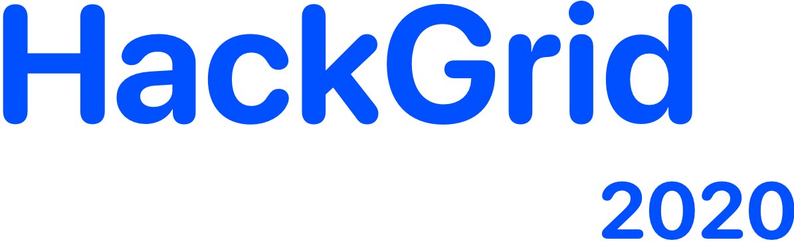
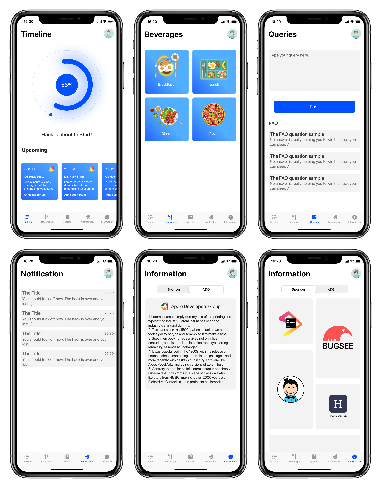

# 

### Hackgrid-2020 iOS Application

### <ins>Introduction<ins>

Hackgrid is 36-hour hackathon conducted by Apple developers group VIT. This app facilitates the participants with realtime information about the hack.

## Application Preview

> Apple Developers Group (ADG) is a name synonymous with excellence, simplicity and dedication. It is a registered student community at VIT, Vellore established under the Apple University program. A coterie of talented minds seeking not just success but perfection.

> You can Contact us at [adgvit.com](https://adgvit.com/contact.html)

## Features
- Realtime timeline of the hackathon
- Food & Beverages information
- FAQ section

## Contributors
* [Aaryan Kothari](https://github.com/aaryankotharii)
* [Devang Patel](https://github.com/pateldevang)

## License 

Copyright (c) 2020 ADG-VIT

Licensed under MIT License: https://opensource.org/licenses/MIT

See [LICENSE](https://github.com/pateldevang/Hackgrid/blob/master/LICENSE) for more information

